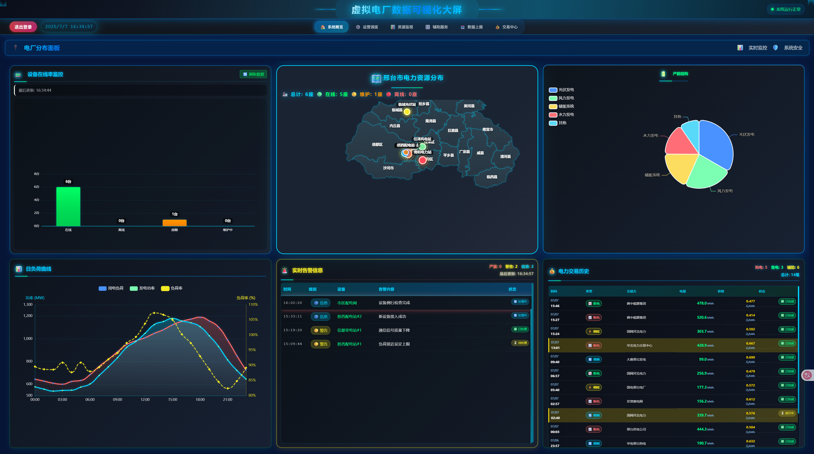

虚拟电厂数据可视化平台

## 项目简介

虚拟电厂数据可视化平台是一个基于React技术栈的现代化能源管理系统，提供实时监控、数据分析和设备管理等功能。

## 功能特性

- 🏠 **仪表盘概览** - 实时数据监控和系统状态展示
- ⚡ **资源接入管理** - 电力资源的接入、监控和管理
- 🔧 **运行管理** - 设备运行状态监控和故障管理
- 📊 **资源监测** - 详细的资源性能分析和趋势预测
- 🎛️ **聚合控制** - 智能化的电力调度和控制
- 📈 **数据报表** - 全面的数据统计和报表生成

## 项目运行截图

### 主界面 - 仪表盘概览
<!-- 方法1: 如果截图文件在项目根目录的screenshots文件夹中 -->



<!-- 
如果您想使用其他方式添加截图，可以参考以下方法：

方法2: 使用相对路径（如果截图在images文件夹中）


方法3: 使用绝对路径（在线图片链接）


方法4: 使用HTML标签（可以控制图片大小）


方法5: 多张图片并排显示
<div style="display: flex; gap: 10px;">
  
  
</div>
-->

## 技术栈

- **前端框架**: React 18
- **UI组件**: 自定义组件 + CSS3
- **图表库**: ECharts
- **构建工具**: Create React App
- **样式**: CSS3 + 渐变效果 + 动画

## 安装和运行

### 环境要求
- Node.js >= 14.0.0
- npm >= 6.0.0

### 安装依赖
```bash
npm install
```

### 启动开发服务器
```bash
npm start
```

### 构建生产版本
```bash
npm run build
```

## 项目结构

```
virtualpowerplant/
├── public/                 # 静态资源
├── src/                   # 源代码
│   ├── components/        # 公共组件
│   ├── pages/            # 页面组件
│   │   └── HomePageView/ # 主页面
│   │       ├── HomeView/ # 仪表盘
│   │       ├── ResourceAccess/ # 资源接入
│   │       ├── OperationManagement/ # 运行管理
│   │       ├── ResourceMonitoring/ # 资源监测
│   │       ├── AggregationControl/ # 聚合控制
│   │       └── DataReporting/ # 数据报表
│   └── styles/           # 样式文件
├── screenshots/          # 项目截图（需要创建）
└── README.md            # 项目说明
```

## 如何添加截图

1. **创建截图文件夹**：在项目根目录创建 `screenshots` 文件夹
2. **保存截图**：将项目运行截图保存到 `screenshots` 文件夹中
3. **命名规范**：建议使用有意义的文件名，如：
   - `dashboard.png` - 仪表盘截图
   - `resource-access.png` - 资源接入页面截图
   - `operation-management.png` - 运行管理页面截图
4. **更新README**：截图保存后会自动在此文档中显示

## 许可证

MIT License
